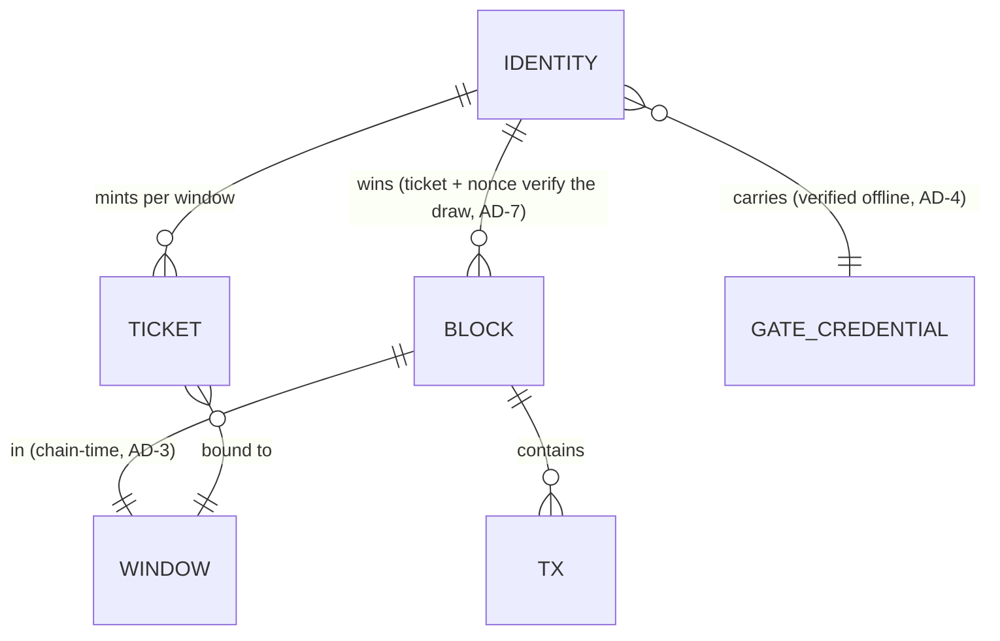

# Architecture Spine — SuccinctCoin

## Design Paradigm

**Event-driven hexagonal core.** `packages/core` is a pure-Node event-emitting state machine. It owns consensus, ledger, identity, and chain state; it declares **ports** (`net`, `store`, `clock` (chain-time), `gate` (credential verifier), `ui-sink`) and accepts **adapters**: libp2p, a file-backed store, the chain-slot clock, offline gate-credential verifiers, and the Electron IPC bridge. The shell (Electron + React) is a thin adapter *client* of the core, never the other way around.

Why hexagonal: the same core must run in three hosts — plain-Node CI, Electron main process, and a future headless daemon — with one code path. Layered-monolith would leak host dependencies into the core and fragment the test suite (the exact failure the spec's simplicity mandate forbids).

```mermaid
flowchart LR
  subgraph core ["packages/core (pure Node, event-emitting state machine)"]
    C[consensus] --> L[ledger]
    C --> I[identity]
    C --> S[chainstore port]
    L --> S
    I --> G[gate port (offline verifier)]
  end
  N[libp2p adapter] -->|blocks/tx/tickets| C
  S2[file store adapter] --> S
  CLK[chain-slot clock] --> C
  IPC[Electron IPC bridge] -->|commands in| C
  C -->|events out| UI[React UI (renderer)]
```

## Invariants & Rules

### AD-1 — Core/shell seam (pure-Node core)

- **Binds:** all units [ADOPTED — spec constraint 6]
- **Prevents:** the core acquiring `electron`/renderer/UI imports, which would make it untestable headless and the shell unswappable (Tauri later).
- **Rule:** `packages/core` has zero imports of `electron`, the renderer, or any UI library. Shell imports core; never reverse. Core's public surface is: events (out), commands (in), typed read-API — all owned by `core/events/` (see AD-9 tightening: event payload types and read-API signatures are enumerated there; no unit defines its own summary types).

### AD-2 — Single mutation path

- **Binds:** CAP-1, CAP-5, all state owners
- **Prevents:** two builders crediting balances through different paths (UI optimistic credit vs network-apply vs consensus-apply) — the classic ledger-divergence bug.
- **Rule:** all chain + ledger state mutation happens in one `applyBlock(block)` function, invoked only by the consensus loop. Ledger and chain store are read-only everywhere else, including the UI. `applyBlock` receives a **fully validated domain block** — protocol validation (draw, tickets, windows) is the consensus loop's exclusive duty; the ledger performs arithmetic and invariant checks only and never re-validates protocol rules. No module may mutate balances directly.

### AD-3 — Chain-time only

- **Binds:** CAP-1, CAP-2, consensus + identity
- **Prevents:** wall-clock windows producing ticket-validity disputes between nodes with divergent clocks (attack-pass finding A-3) and nondeterministic tests.
- **Rule:** every protocol decision (window index, lookback L, ticket validity, draw, difficulty) uses chain time — slot count + last block hash. Wall clock is allowed only for UI display.

### AD-4 — Identity is protocol; gate is external and offline

- **Binds:** CAP-2
- **Prevents:** the gate becoming a per-window network SPOF, and two units trusting gate outputs at different levels (one verifying live, one trusting the credential).
- **Rule:** the protocol verifies gate credentials **offline** (signature/credential check only, no network call). The gate is never a per-window dependency. The verifier port is exactly `GateVerifier.verify(cred, window) → { valid, identityId, attestedUntilWindow }`; `GateCredential = { gateId: string, blob: Uint8Array }` is the **only representable credential shape** (the blob is unreadable outside the verifier by type). No module parses credential fields outside the verifier; a Ticket carries at most the credential **hash**, never the blob. New gates enter only by protocol upgrade. Dual gate at launch (which two is a spec open question, not an architecture call).

### AD-5 — Money types

- **Binds:** CAP-5, all units touching amounts
- **Prevents:** float drift in balances, and serialization divergence (one unit binary uint64, another decimal string) — including on disk, where an int64/REAL column silently corrupts a balance past 2⁵³ after restart.
- **Rule:** amounts are integer base units (`BigInt`) in memory and on the wire. `big.js` appears at exactly two boundaries: fee = amount × rate (at `applyBlock`) and display conversion. Floating-point is banned from the ledger. **Persisted** amounts are decimal strings (or exact arbitrary-precision integer columns); float and int64 amount columns are banned; a property test round-trips random BigInts up to 10³⁰ through the store. Wire/JSON encoding is a **decimal string** (Big `toJSON` style); raw `BigInt` is banned from JSON (`JSON.stringify(123n)` throws). *Refines spec constraint "big.js records all money": exact-decimal money is recorded via big.js at every boundary where a decimal exists; integer base units (BigInt) are themselves exact records, so big.js is not needed in the integer path.*

### AD-6 — Hot-path crypto + canonical hash

- **Binds:** CAP-1, mining loop
- **Prevents:** a builder "helpfully" using big.js or a pure-JS uniform hash in the per-attempt mining loop (measured ~1000× and ~35× penalties); and two units hashing *different bytes* for the same block (network-wide liveness death).
- **Rule:** per-attempt PoW = `node:crypto` sha256 + plain integer counter; big.js and pure-JS keccak are banned from per-attempt code paths. The **block hash** = sha256 over the canonical protobuf encoding of the `Block` message (AD-12), **counter included as a field of that message**; the PoW check re-hashes exactly those bytes.

### AD-7 — Verifiable draw is one pinned pure function

- **Binds:** CAP-1, CAP-2, consensus
- **Prevents:** the broadcast-race degeneracy (any eligible node claiming any slot — attack-pass RT-2); a test harness validating a *different* draw than the one that ships (vacuous launch gate test); and a second node forking the chain over a divergent formula.
- **Rule:** the draw is **exactly one exported function** in `core/consensus` (`drawWindow(tickets, challenge, weights)`); the block verifier and **all tests import it — re-implementation is banned**. Formula (direction-checked): each ticket's priority `c = H(nonce ‖ challenge)` read uniform in (0,1); the winner **minimizes `c^uptime`** — higher uptime ⇒ higher win probability (minimizing `c^(1/uptime)` is the *inverse* and is banned). The draw's input set = tickets accepted at or before the previous window's last block (a fixed chain point); late tickets never invalidate an accepted block. No RNG source other than committed nonces; no network-position term; any node recomputes the winner from public data. A block whose (ticket, nonce) does not verify the draw is rejected. **≥3 fixed test vectors** (ticket set → expected winner) ship in the repo; changing the draw is a protocol change (genesis version bump). Launch gate test: an unselected node cannot produce a valid block.

### AD-8 — Wire format

- **Binds:** CAP-3, all protocol messages
- **Prevents:** two units choosing incompatible encodings (e.g. uint64 overflow vs decimal string) or ad-hoc JSON on hot topics.
- **Rule:** protocol messages use protobuf (`protons-runtime`, the libp2p ecosystem convention). Amounts travel as decimal strings; IDs as 32-byte hex. One stable topic per message class (blocks, tx, tickets, gossip). The `.proto` file is the schema owner — see AD-12.

### AD-9 — Single-writer persistence

- **Binds:** CAP-1, CAP-5, chainstore
- **Prevents:** two-process write corruption and the UI bypassing validation by writing state directly.
- **Rule:** the chain store is the only owner of on-disk state; exactly one writer — the consensus loop in the main process. The store opens with an **exclusive lock** (write lock + data-directory lockfile); a second core instance against the same directory **fails at boot** with a clear error. UI and net read via the core read-API — `core/events/` is the single owner of event payload types and read-API signatures (including `getPeers`, `getBlock`); the event stream plus the read-API is the **complete UI data source** ("no polling" means never poll, not "events alone suffice"). Every command resolves its promise; result events are optional additions, never replacements. Store engine (SQLite / LevelDB / custom) is a code-level choice, not an invariant.

### AD-10 — Testability seam

- **Binds:** CAP-6 [ADOPTED — spec CAP-6]
- **Prevents:** the test suite requiring a desktop shell or real network, which would fragment coverage and break headless CI.
- **Rule:** all core tests run plain-Node with `@libp2p/memory` (in-process transport); zero real sockets in CI. The libp2p first-party `electron-main` test target (verified present in `@libp2p/memory` 2.0.28) covers the in-app path. Tests **import** the production draw (AD-7) and generated protocol types (AD-12) — no parallel reference implementations of protocol rules.

### AD-11 — Key material boundary

- **Binds:** CAP-2, CAP-4
- **Prevents:** renderer compromise exposing identity keys — the structural half of the anti-rental property (spec: identity keys non-exportable).
- **Rule:** identity private keys live in the core (Electron main process). They never cross the IPC boundary to the renderer in plaintext — the UI receives only peer IDs, status, and signed artifacts.

### AD-12 — Canonical protocol encoding

- **Binds:** CAP-1, CAP-2, CAP-3, all units touching wire/protocol shapes
- **Prevents:** two units defining parallel message shapes (protobuf silently zero-fills unknown fields — a field-number mismatch means *every ticket fails verification*, a silent liveness death); and encoder/decoder/signature/draw drifting apart.
- **Rule:** `packages/core/proto/protocol.proto` is the **single source of truth** for `Block`, `Tx`, `Ticket`, `PeerInfo` field sets *and numbering*; core TS protocol types are **generated from it** (protons) — hand-written protocol types are banned. Inside cryptographic digests all integers are **big-endian fixed-width** (decimal strings appear only in JSON/wire scalar fields, never inside digests). The ticket signature is over `sha256(identityId ‖ u64be(windowIndex) ‖ challenge ‖ nonceCommitment)`. The `Block` message MUST include the winner's ticket **and nonce** (AD-7). One **golden round-trip vector** (fixed block + ticket hex) ships in the repo; encoder, decoder, signature verifier, and draw must all pass it.

## Consistency Conventions

| Concern | Convention |
| --- | --- |
| Language & toolchain | TypeScript **5.x** (battle-tested JS tsc; the native 7.x tsgo is a documented opt-in) + Vitest + pnpm + Node 24 (Lodestar/EthereumJS precedent) |
| Naming | entities: `Block`, `Tx`, `Ticket`, `Identity`, `Window`; files kebab-case; core events PascalCase nouns (`BlockApplied`, `SlotWon`, `IdentityLapsed`); commands imperative (`startMining`, `enrollIdentity`) |
| Data & formats | amounts: integer base units (BigInt) in memory, decimal strings on wire/JSON/disk (AD-5); inside digests: big-endian fixed-width ints (AD-12); IDs: 32-byte hex; time: chain-time slot index (AD-3); errors: `{ code: 'SC-<DOMAIN>-<n>', message }` |
| State & cross-cutting | mutation only via `applyBlock` (AD-2); logging via `@libp2p/logger` (ecosystem convention); config = genesis config + node config, both JSON, validated at boot |
| Events | core emits typed events; UI subscribes; no polling. Every command resolves its promise (AD-9) |

## Stack

SEED — verified live against npm registry 2026-10-01; the code owns this once it exists.

| Name | Version |
| --- | --- |
| Node.js | 24 (current LTS; revisit at Node 26 LTS) |
| TypeScript | **5.x** (default — proven JS tsc for a simplicity-first long-lived coin); 7.0.2 (native tsgo, first stable ~2 months) is a documented opt-in |
| libp2p | 3.3.11 |
| @libp2p/gossipsub | 17.1.2 |
| @libp2p/yamux | 8.0.3 |
| @libp2p/noise | 17.0.3 |
| @libp2p/tcp | 11.0.28 |
| @libp2p/mdns | 12.0.32 |
| @libp2p/bootstrap | 12.0.32 |
| @libp2p/circuit-relay-v2 | 4.2.13 (package renamed — `@libp2p/circuit-relay` no longer exists) |
| @libp2p/memory | 2.0.28 |
| electron | 44.5.1 |
| @electron-forge/cli | 8.0.1 |
| react | 19.3.0 |
| vite | 8.3.2 (build engine: Rolldown ~1.2.11) |
| vitest | 5.0.3 |
| fast-check | 4.10.2 |
| big.js | 7.0.1 |

## Operational Envelope

- **Network topology:** all nodes are desktop (user hardware). The only server-side components: one or more community-run **circuit-relay-v2** relays (NAT traversal) and **external gate providers** (offline-credential; not protocol dependencies — AD-4). `[ASSUMPTION]` at least one relay exists at launch; if not, early NATed nodes fall back to WebSockets outbound.
- **Environments:** CI (plain Node, memory transport), dev (Electron), testnet (public relay), mainnet.
- **Genesis:** `config/genesis.json` = static bootstrap list + emission params + K (re-attestation cadence) + L (uptime lookback) + accepted-gate registry + protocol version.
- **Upgrades / forks:** a **protocol upgrade is the only path** for gate admission and parameter change — hard fork with coordinated restart (no soft forks; small community network). Changing the draw, schema, or gate registry is a protocol change (genesis version bump — AD-7/AD-12).
- **Node updates:** manual at launch; auto-update deferred.
- **Backup / restore:** the store directory **is** the state; backup = copy it (AD-9 exclusive lock makes it safe while stopped).
- **Security ops:** gate compromise → revoke the accepted gate (upgrade), fake IDs die within K windows (registration-design R3), affected identities re-enroll.

## Structural Seed

```text
{root}/
  packages/
    core/            # pure-Node node core (AD-1). Zero UI imports.
      proto/         # protocol.proto — single schema owner (AD-12) + golden vector
      src/
        consensus/   # slot loop, drawWindow (AD-7, single impl), difficulty, applyBlock (AD-2)
        ledger/      # balances, fee (big.js boundary), invariants (AD-5)
        identity/    # tickets, re-attestation, GateVerifier port (AD-4)
        net/         # libp2p adapter, topics (AD-8)
        store/       # chainstore port + adapter, exclusive lock (AD-9)
        events/      # typed events + commands + read-API — the core public surface (AD-1/AD-9)
      test/          # plain-Node Vitest + fast-check + @libp2p/memory (AD-10); imports prod draw + generated types
    app/             # Electron shell. Only place electron is imported.
      src/
        main/        # Electron main: hosts core, IPC bridge (AD-11)
        renderer/    # React UI (Vite)
        preload/     # IPC boundary — keys never cross (AD-11)
  bench/             # existing perf harness (sha256/big.js numbers)
  config/
    genesis.json     # bootstrap list, emission, K, L, accepted-gate registry, protocol version
```

Dependency direction (AD-1 is the rule; this is its diagram):

```mermaid
flowchart TD
  UI[app/renderer (React)] -->|IPC only| MAIN[app/main (Electron)]
  MAIN --> CORE[packages/core]
  CORE --> LP[libp2p + adapters]
  CORE --> STORE[chainstore adapter]
  CORE -. never .-x UI
  LP -. never .-x MAIN
```

Core entities (names + relationships only):



## Capability → Architecture Map

| Capability / Area | Lives in | Governed by |
| --- | --- | --- |
| CAP-1 slot-based mining | `core/consensus` | AD-2, AD-3, AD-6, AD-7, AD-9, AD-12 |
| CAP-2 operator identity | `core/identity` | AD-3, AD-4, AD-7, AD-11, AD-12 |
| CAP-3 node network | `core/net` | AD-8, AD-10, AD-12 |
| CAP-4 desktop app | `packages/app` | AD-1, AD-9, AD-11 |
| CAP-5 exact money | `core/ledger` | AD-2, AD-5 |
| CAP-6 testable in plain Node | `packages/core/test` | AD-7, AD-10, AD-12 |
| Registration design (R1–R4) | `core/identity` + `core/consensus` | AD-3, AD-4, AD-7, AD-12 + `registration-design.md` |

## Deferred

| Deferred | Why it can wait |
| --- | --- |
| DHT threshold (when bootstrap+mDNS stop sufficing) | Spec open question; decide via memory-transport simulation or day-one Kad-DHT. AD-8/AD-12 topics and schema are DHT-agnostic. |
| Concrete gate implementations (which two at launch) | Protocol binds only the gate-verifier interface (AD-4); gate choice is a spec open question, not architecture. |
| K (re-attestation cadence) and L (uptime lookback) values | Genesis parameters; architecture binds the interface, not the numbers. |
| Difficulty/target adjustment algorithm | Consensus detail; must satisfy "commodity hardware reaches one hash per slot trivially" (CAP-1 success). |
| Wallet UX (enrollment flow, status views) | bmad-ux territory. |
| Node auto-update | Manual updates at launch (Operational envelope); revisit with scale. |
| Relay-operator availability at launch `[ASSUMPTION]` | Assumes at least one community-run circuit-relay-v2 node exists; if not, early NATed nodes fall back to WebSockets outbound. Not an architecture branch. |
